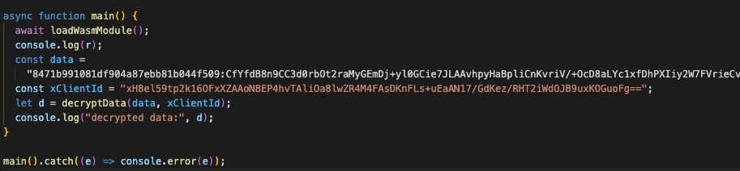

## Khám phá cách encrypt/decrypt data từ API NeroX

Sử dụng DevTools check API bị mã hoá data, ví dụ `/x/v3/user/copy-trading-statistic?limit=10`, so sánh với các API khác ta thấy có một field lạ `X-Client-Id` ở Headers (ảnh bên dưới).


Tìm các đoạn code có liên quan tới keyword này. Open tab "Sources" trong DevTools và tìm kiếm với từ khóa `X-Client-Id`. Thông qua các keyword interceptors, request, response ta có thể tạm xác định đây là phần decrypt data từ API. Copy lại toàn bộ file này và save vào [`decrypt_module.js`](./decrypt_module.js).


Xác định đoạn code decrypt data

```javascript
async (e) => {
  let t = e.data,
    r = null == e ? void 0 : e.headers["x-client-id"],
    [n, a] = t.data.split(":"),
    l = s(n),
    i = JSON.parse((await o()).decrypt(r.toString(), l, a)),
    d = e.config,
    u = null == d ? void 0 : d.validationSchema;
  if (u)
    try {
      return u.cast(i);
    } catch (e) {
      console.error("Validation error:", e.errors);
    }
  return i;
};
```

Như vậy ta sẽ có function decrypt data từ API như bên dưới. Việc còn lại chỉ là tìm phần code implement function decrypt từ module `o`

```javascript
function s2(e) {
  if (e.length % 2 != 0) throw Error("Invalid hex string");
  let t = new Uint8Array(e.length / 2);
  for (let r = 0; r < e.length; r += 2) t[r / 2] = parseInt(e.substr(r, 2), 16);
  return t;
}

function decryptData(encryptedData, xClientId) {
  let [n, a] = encryptedData.split(":");
  let i = s2(n);
  let l = JSON.parse(decrypt(xClientId.toString(), i, a));
  return l;
}
```

Tiếp tục tìm kiếm các đoạn code implement function `decrypt`, tìm kiếm function `o`

```javascript
async function o() {
  return n || ((n = await r.e(8894).then(r.bind(r, 58894))), await n.default()), n;
}
```

function này thực hiện load một module khác, tiếp tục tìm kiếm module này sử dụng chức năng tìm kiếm trong Sources với từ khoá `58894`. Ta tìm được một module có liên quan tới webassembly. Save lại trong [`wasm_module.js`](./wasm_module.js).


Chú ý vào function `decrypt` trong module này tương ứng với function `b`. Ta sẽ tìm cách để implement lại function này trong script decrypt.

```javascript
function b(e, n, t) {
  let o, a;
  try {
    let l = s(e, r.__wbindgen_malloc, r.__wbindgen_realloc),
      c = i,
      d = _(n, r.__wbindgen_malloc),
      u = i,
      b = s(t, r.__wbindgen_malloc, r.__wbindgen_realloc),
      w = i,
      g = r.decrypt(l, c, d, u, b, w);
    return (o = g[0]), (a = g[1]), f(g[0], g[1]);
  } finally {
    r.__wbindgen_free(o, a, 1);
  }
}
```

Việc còn lại là xử lý load wasm (gán vào `r`), copy các function liên quan `s`, `_`, các biến `i`, `o`.

Ta xử lý phần load code webassembly.

1. Thực hiện download file wasm từ https://dev.nerox.ai/_next/static/media/crypt_bg.cbf60fca.wasm, save lại [crypt_bg.cbf60fca.wasm](./crypt_bg.cbf60fca.wasm)

2. Sau một hồi vọc vạch client code và hỏi AI, đoạn code initialize webassembly code như sau

```javascript
const fs = require("node:fs");

// Read the .wasm file
const wasmBuffer = fs.readFileSync("./crypt_bg.cbf60fca.wasm");

let r;

// Set up imports object
const imports = {
  env: {},
  wbg: {
    __wbindgen_init_externref_table: function () {
      let e = r.__wbindgen_export_0,
        n = e.grow(4);
      e.set(0, void 0), e.set(n + 0, void 0), e.set(n + 1, null), e.set(n + 2, !0), e.set(n + 3, !1);
    },
  },
};

function loadWasmModule() {
  if (r) return r;
  return WebAssembly.instantiate(new Uint8Array(wasmBuffer), imports).then((wasmModule) => {
    const instance = wasmModule.instance;
    const exports = instance.exports;
    r = exports;

    // Call __wbindgen_start for initialization if present
    if (typeof exports.__wbindgen_start === "function") {
      exports.__wbindgen_start();
      console.log("__wbindgen_start called for WASM initialization.");
    } else {
      console.warn("__wbindgen_start not found in WASM exports.");
    }

    return exports;
  });
}
```

Log object `r`:

```
__wbindgen_start called for WASM initialization.
[Object: null prototype] {
  memory: Memory [WebAssembly.Memory] {},
  encrypt: [Function: 62],
  decrypt: [Function: 63],
  create_key: [Function: 61],
  __wbindgen_export_0: Table [WebAssembly.Table] {},
  __wbindgen_malloc: [Function: 60],
  __wbindgen_realloc: [Function: 65],
  __wbindgen_free: [Function: 72],
  __wbindgen_start: [Function: 0]
}
```

Toàn bộ phần code decrypt data xem trong [`main.js`](./main.js).

Kêt quả chạy script:



```
__wbindgen_start called for WASM initialization.
[Object: null prototype] {
  memory: Memory [WebAssembly.Memory] {},
  encrypt: [Function: 62],
  decrypt: [Function: 63],
  create_key: [Function: 61],
  __wbindgen_export_0: Table [WebAssembly.Table] {},
  __wbindgen_malloc: [Function: 60],
  __wbindgen_realloc: [Function: 65],
  __wbindgen_free: [Function: 72],
  __wbindgen_start: [Function: 0]
}
decrypted data: {
  items: [
    {
      id: 1,
      xUserId: 78651,
      avgPnL: '3.637303',
      winRate: 0.24352331606217617,
      rugRate: 0.1476683937823834,
      avgROI: '-0.6352',
      growthRate: '0.4818',
      interactionLastMonth: 15061,
      totalUSD: '0.000001',
      numberOfTokens: 372,
      numberOfEvaluatedWinTokens: 386,
      numberOfEvaluatedRugTokens: 386,
      createdAt: '2025-05-12T15:02:58.325Z',
      updatedAt: '2025-05-12T22:44:37.155Z',
      deletedAt: null,
      xUser: [Object]
    },
    {
      id: 2,
      xUserId: 79234,
      avgPnL: '11.567585',
      winRate: 0.16067653276955626,
      rugRate: 0.4217391304347825,
      avgROI: '-0.5602',
      growthRate: '0.1907',
      interactionLastMonth: 164,
      totalUSD: '0.000000',
      numberOfTokens: 469,
      numberOfEvaluatedWinTokens: 473,
      numberOfEvaluatedRugTokens: 460,
      createdAt: '2025-05-12T15:02:59.929Z',
      updatedAt: '2025-05-13T04:54:36.053Z',
      deletedAt: null,
      xUser: [Object]
    },
    {
      id: 3,
      xUserId: 78693,
      avgPnL: '1.351266',
      winRate: 0.27631578947368424,
      rugRate: 0.10810810810810811,
      avgROI: '0.1609',
      growthRate: '-0.1572',
      interactionLastMonth: 196,
      totalUSD: '0.000000',
      numberOfTokens: 75,
      numberOfEvaluatedWinTokens: 76,
      numberOfEvaluatedRugTokens: 74,
      createdAt: '2025-05-12T15:03:04.431Z',
      updatedAt: '2025-05-13T03:25:33.001Z',
      deletedAt: null,
      xUser: [Object]
    },
    {
      id: 4,
      xUserId: 2,
      avgPnL: '1.764722',
      winRate: 0.2682926829268293,
      rugRate: 0.15,
      avgROI: '-0.7530',
      growthRate: '3.9683',
      interactionLastMonth: 1219,
      totalUSD: '0.000000',
      numberOfTokens: 38,
      numberOfEvaluatedWinTokens: 41,
      numberOfEvaluatedRugTokens: 40,
      createdAt: '2025-05-12T15:03:12.356Z',
      updatedAt: '2025-05-12T15:03:12.356Z',
      deletedAt: null,
      xUser: [Object]
    },
    {
      id: 5,
      xUserId: 80014,
      avgPnL: '0.160760',
      winRate: 0.5,
      rugRate: 0.14285714285714285,
      avgROI: '0.1480',
      growthRate: '0.0000',
      interactionLastMonth: 0,
      totalUSD: '0.000000',
      numberOfTokens: 8,
      numberOfEvaluatedWinTokens: 8,
      numberOfEvaluatedRugTokens: 7,
      createdAt: '2025-05-12T15:03:12.727Z',
      updatedAt: '2025-05-12T15:03:12.727Z',
      deletedAt: null,
      xUser: [Object]
    },
    {
      id: 6,
      xUserId: 78773,
      avgPnL: '69.281783',
      winRate: 0.24955436720142624,
      rugRate: 0.14031971580817054,
      avgROI: '-0.4115',
      growthRate: '1.4561',
      interactionLastMonth: 6716,
      totalUSD: '0.000000',
      numberOfTokens: 549,
      numberOfEvaluatedWinTokens: 561,
      numberOfEvaluatedRugTokens: 563,
      createdAt: '2025-05-12T15:03:19.842Z',
      updatedAt: '2025-05-12T20:43:23.455Z',
      deletedAt: null,
      xUser: [Object]
    },
    {
      id: 7,
      xUserId: 96939,
      avgPnL: '0.987764',
      winRate: 0.16666666666666666,
      rugRate: 0.25000000000000006,
      avgROI: '-0.3810',
      growthRate: '1.1043',
      interactionLastMonth: 314,
      totalUSD: '0.000000',
      numberOfTokens: 72,
      numberOfEvaluatedWinTokens: 72,
      numberOfEvaluatedRugTokens: 72,
      createdAt: '2025-05-12T15:25:47.436Z',
      updatedAt: '2025-05-12T15:25:47.436Z',
      deletedAt: null,
      xUser: [Object]
    },
    {
      id: 8,
      xUserId: 95918,
      avgPnL: '1.667601',
      winRate: 0.75,
      rugRate: 0,
      avgROI: '-0.2619',
      growthRate: '0.0000',
      interactionLastMonth: 0,
      totalUSD: '0.000000',
      numberOfTokens: 4,
      numberOfEvaluatedWinTokens: 4,
      numberOfEvaluatedRugTokens: 2,
      createdAt: '2025-05-12T15:25:48.791Z',
      updatedAt: '2025-05-12T15:25:52.214Z',
      deletedAt: null,
      xUser: [Object]
    },
    {
      id: 9,
      xUserId: 79009,
      avgPnL: '1.925253',
      winRate: 0.3548387096774194,
      rugRate: 0.2,
      avgROI: '0',
      growthRate: '0',
      interactionLastMonth: 0,
      totalUSD: '0',
      numberOfTokens: 31,
      numberOfEvaluatedWinTokens: 31,
      numberOfEvaluatedRugTokens: 30,
      createdAt: '2025-05-12T16:15:34.064Z',
      updatedAt: '2025-05-12T16:15:34.064Z',
      deletedAt: null,
      xUser: [Object]
    },
    {
      id: 10,
      xUserId: 95074,
      avgPnL: '1.415434',
      winRate: 0.18181818181818182,
      rugRate: 0.4,
      avgROI: '0',
      growthRate: '0',
      interactionLastMonth: 0,
      totalUSD: '0',
      numberOfTokens: 11,
      numberOfEvaluatedWinTokens: 11,
      numberOfEvaluatedRugTokens: 10,
      createdAt: '2025-05-12T16:40:41.919Z',
      updatedAt: '2025-05-12T16:40:41.919Z',
      deletedAt: null,
      xUser: [Object]
    }
  ],
  total: 19904
}
```
